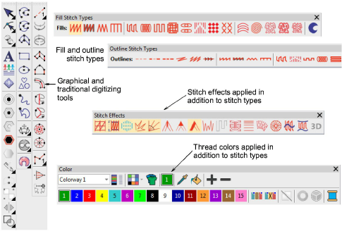

# Decorative embroidery

EmbroideryStudio provides many techniques for embellishing the basic stitch types covered in this section. Some are treated as stitch types in their own right – both outline and fill – and appear on the Stitch Types toolbars. Others can be applied as stitch effects. In all cases, the digitizing techniques are similar. [See also Digitizing Shapes.](../input/Digitizing_Shapes)

## Related topics...

- [Decorative outlines](Decorative_outlines)
- [Patterned stitching](Patterned_stitching)
- [Curved stitching](Curved_stitching)
- [Specialty stitching](Specialty_stitching)
- [Motif stitching](Motif_stitching)
