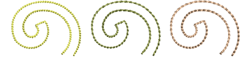
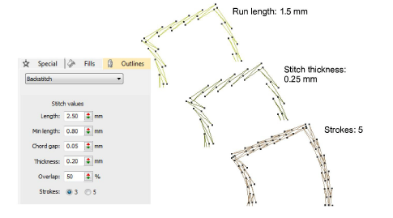
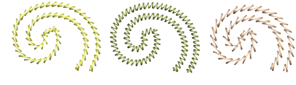
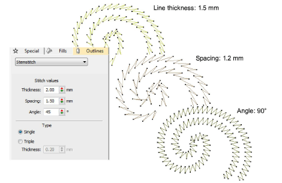

# Decorative outlines

|  | Use Outline Stitch Types > Backstitch to place a row of backstitches along a digitized line. Right-click for settings. |
| ---------------------------------------- | ---------------------------------------------------------------------------------------------------------------------- |
|  | Use Outline Stitch Types > Stemstitch to place a row of stemstitches along a digitized line. Right-click for settings. |

While simple [run stitching](../../glossary/glossary) is typically used to add borders and pickout runs, there are stitch types for creating decorative outlines. Backstitch is an older-style, adaptable stitch which can be used for delicate outlines. Stemstitch is thicker and can be used to mimic hand-sewn embroidery. Digitize decorative outlines as you would a Run stitch outline.

## To create decorative runs...

- For more delicate outlines, use Backstitch. Backstitch is an older-style, adaptable stitch which follows intricate curves well.

- Backstitch settings allow you to specify exact stitch length, chord gap, thickness and overlap values as well as number of strokes. Length, Min Length, and Chord Gap values work like the Variable Run Length option.

- For thicker, decorative lines, use Stemstitch. Stemstitch can be used to mimic hand-sewn embroidery. It is used for stems and vines with other decorative stitches, or as an outline for satin or motif fills.

- Stemstitch settings allow you to specify exact stitch and line thickness, spacing and overlap values as well as thickness (number of strokes).

Note: For Triple stitching, you can also adjust Stitch Thickness.

## Related topics...

- [Embroidery digitizing](../input/Embroidery_digitizing)
- [Digitizing outlines & details](../input/Digitizing_outlines_details)
- [Converting designs with CorelDRAW Graphics](../../Automatic/automatic/Converting_designs_with_CorelDRAW_Graphics)
