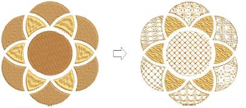

# Motif stitching

|    | Use Outline Stitch Types > Motif Run to create a string of motifs along a digitized line.                                                   |
| -------------------------------------- | ------------------------------------------------------------------------------------------------------------------------------------------- |
|  | Use Fill Stitch Types > Motif Fill to create decorative fills using embroidery motifs to form repeating patterns. Right-click for settings. |
|    | Use Traditional Digitizing > Use Motif to add motifs to design one-by-one. Rotate, scale, or mirror as you add.                             |

Motifs are predefined design elements, such as hearts, leaves or border patterns. They generally consist of one or more simple objects, and are stored in a special motif set. Motifs can be used for ornamental outlines and patterned fills. Use the ones provided with the software or create your own. Motifs can be scaled, rotated and mirrored in the same way as other objects. You can even use them to create interesting three dimensional effects. [See also Motif Stitching.](../../Decorative/motifs/Motif_Stitching)

::: info Note
Auto Underlay is deactivated with this feature and [stitch angle](../../glossary/glossary#stitch-angle) has no effect.
:::

## Related topics...

- [Selecting & placing motifs](../../Decorative/motifs/Selecting_placing_motifs)
- [Motif runs](../../Decorative/motifs/Motif_runs)
- [Motif fills](../../Decorative/motifs/Motif_fills)
