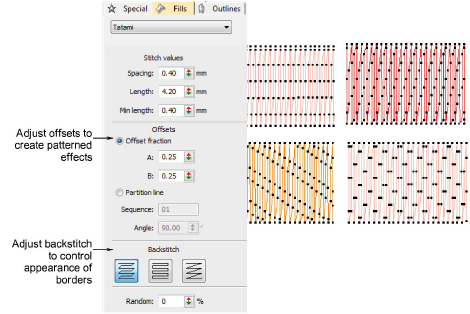
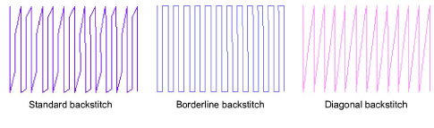

# Other tatami settings

Tatami settings also allow you to control needle offsets for more even distribution of needle points or for patterned effects. Choose a different backstitch type to control edge stitching.

## Offsets

With tatami fills you can specify how each row is offset in order to create patterns formed by needle penetrations. You do this by adjusting either offset fractions or partition lines.

Tip: Using a Random factor you can eliminate the split line patterns formed by regular needle penetrations and distribute stitches randomly inside a shape.

## Backstitch

Tatami backstitch is the term used for every second row of stitches in a tatami fill. There are three types available – Standard, Borderline, and Diagonal.

The table below describes the differences:

| Type                  | Notes                                                                                                                                                                                            |
| --------------------- | ------------------------------------------------------------------------------------------------------------------------------------------------------------------------------------------------ |
| Standard backstitch   | Because the rows are different lengths, there are fewer small stitches at the edge of the shape, reducing possible damage to the fabric. Standard backstitch is suitable for high density fills. |
| Borderline backstitch | With lower density fills, borderline backstitch creates a smooth, well-defined edge. Borderline backstitch is also called Trapunto style.                                                        |
| Diagonal backstitch   | The backward rows are diagonal, directly connecting the forward rows. Diagonal backstitch is suitable for turning shapes, and gives good results with Jagged Edge.                               |

## Related topics...

- [Creating textures with tatami offsets](../../Decorative/patterns/Creating_textures_with_tatami_offsets)
- [Create random patterns](../../Decorative/patterns/Create_random_patterns)
- [Trapunto open stitching](../../Decorative/specialty/Trapunto_open_stitching)
- [Jagged edges](../../Decorative/specialty/Jagged_edges)
