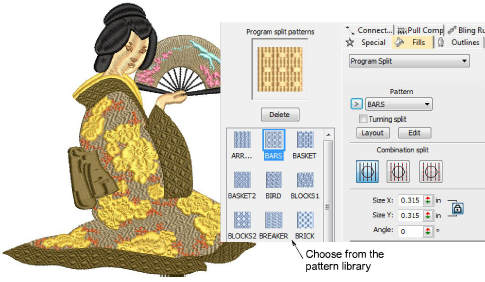

# Patterned stitching

|            | Use Fill Stitch Types > Program Split to create decorative fill stitches where needle penetrations form a tiled pattern.                                  |
| ------------------------------------------------------ | --------------------------------------------------------------------------------------------------------------------------------------------------------- |
|  | Use Outline Stitch Types > Program Split to create borders or columns of even width for decorative needle penetration patterns. Right-click for settings. |

EmbroideryStudio provides tools for creating patterns with needle penetrations. Apply offset fractions or partition lines to tatami fills for a variety of split-line effects. Alternatively, use Program Split or Flexi Split to create decorative fills from predefined patterns. Select from the library or create your own. The Carving Stamp feature allows you to define patterns using a ‘carving stamp’ as a template. Use it also to create your own split lines when you want to add detail to filled objects. [See also Patterned Stitching.](../../Decorative/patterns/Patterned_Stitching)

## Related topics...

- [Creating textures with tatami offsets](../../Decorative/patterns/Creating_textures_with_tatami_offsets)
- [Creating textures with program splits](../../Decorative/patterns/Creating_textures_with_program_splits)
- [Creating patterns with custom splits](../../Decorative/patterns/Creating_patterns_with_custom_splits)
- [Creating patterns with carving stamps](../../Decorative/patterns/Creating_patterns_with_carving_stamps)
