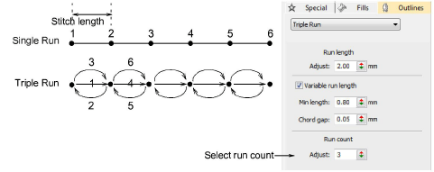

# Run count setting

|  | Use Outline Stitch Types > Triple Run to place a triple row of run stitches along a digitized line. Right-click for settings. |
| -------------------------------------------------------- | ----------------------------------------------------------------------------------------------------------------------------- |

By default, Triple Run repeats each stitch three times. You can change the number of repetitions by adjusting the Run Count value.

::: tip
Use Backtrack and Repeat to reinforce outlines while specifying the direction of the stitching. [See Reinforce outlines for details.](../../Quality/quality/Reinforce_outlines)
:::
