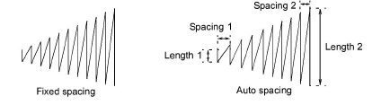
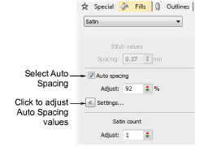
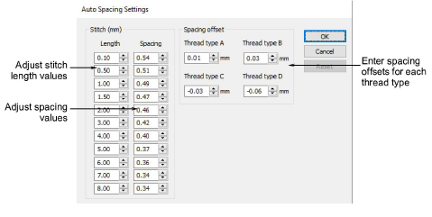
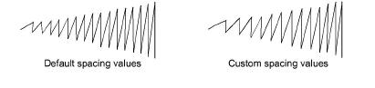

# Satin auto-spacing

|                    | Use Fill Stitch Types > Satin to apply satin stitch to new or selected narrow columns and shapes. Right-click for settings.                                        |
| ------------------------------------------------------------------ | ------------------------------------------------------------------------------------------------------------------------------------------------------------------ |
|              | Use Outline Stitch Types > Satin to create thicker borders or columns of even thickness. Right-click for settings.                                                 |
|        | Use Fill Stitch Types > Satin Raised to create raised surfaces – can be applied to lettering or used with trapunto for quilting effects. Right-click for settings. |
|  | Use Outline Stitch Types > Satin Raised to create raised satin borders – can be used with outlines for quilting effects. Right-click for settings.                 |

Adjust Auto Spacing to specify how rapidly spacing changes and by how much. You can also specify spacing offsets to adjust for different thread types. These settings are intended for digitizing experts. You will usually want to save modified settings to a template.

## To adjust auto-spacing settings...

1Right-click the Satin icon to access object properties.

2Click Settings. The Auto Spacing Settings dialog opens.

3Adjust stitch settings in the Stitch panel:

| Setting | Function                                                                                                                                                                                                              |
| ------- | --------------------------------------------------------------------------------------------------------------------------------------------------------------------------------------------------------------------- |
| Length  | These values define the increments by which spacing is adjusted. The smaller the distance between each length, the more rapidly stitching changes from open to dense. Each length must be greater than the preceding. |
| Spacing | These values define the spacing corresponding to each [stitch length](../../glossary/glossary). See below.                                                                                                            |

4Adjust spacing offsets for different thread types.

The offset determines the amount by which stitch settings will be adjusted for different thread thicknesses.

| Thickness | Description                                  | Default |
| --------- | -------------------------------------------- | ------- |
| A         | Normal embroidery thread (approx. denier 40) | 0.01    |
| B         | Thicker than normal (approx. denier 30)      | 0.03    |
| C         | Finer than normal (approx. denier 80)        | \-0.03  |
| D         | Very fine (approx. denier 100)               | \-0.06  |

Note: You assign the thread type in the Add Thread dialog. Stitch spacing of the assigned thread type is automatically adjusted according to the values set there.

5Click OK.

## Related topics...

- [Working with templates](../properties/Working_with_templates)
- [Modify thread details](../../Basics/threads/Modify_thread_details)
