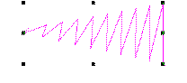
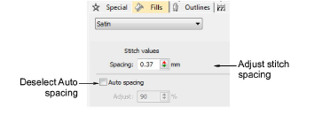
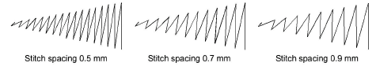

# Satin fixed spacing

|                    | Use Fill Stitch Types > Satin to apply satin stitch to new or selected narrow columns and shapes. Right-click for settings.                                        |
| ------------------------------------------------------------------ | ------------------------------------------------------------------------------------------------------------------------------------------------------------------ |
|              | Use Outline Stitch Types > Satin to create thicker borders or columns of even thickness. Right-click for settings.                                                 |
|        | Use Fill Stitch Types > Satin Raised to create raised surfaces – can be applied to lettering or used with trapunto for quilting effects. Right-click for settings. |
|  | Use Outline Stitch Types > Satin Raised to create raised satin borders – can be used with outlines for quilting effects. Right-click for settings.                 |

In EmbroideryStudio, the Auto Spacing option is turned on by default. Sometimes, however, you may want to control the exact spacing of satin columns. Fixed spacing is sometimes used, for example, for decorative effects – e.g. very open spacing over, say, a tatami background. These effects cannot be achieved with Auto Spacing.

Tip: If you are using a digitizing tablet, you can quickly switch between preset styles with different spacing settings. Each button on the puck accesses the next preset style. For example, clicking button 1 accesses &lt;PRESET_SATIN_1&gt;.

## To apply satin stitch with fixed spacing...

1Select the digitizing method you want to use – e.g. [Column C](../../glossary/glossary).

2Select Satin and create an [embroidery object](../../glossary/glossary). Alternatively, select an existing embroidery object and click Satin.

3Right-click the Satin icon to access object properties.

4Untick Auto Spacing.

5In the Spacing field, enter a fixed spacing:

- To increase density, enter a smaller value.
- To reduce density, enter a larger value.

6Press Enter or click Apply.

## Related topics...

- [Embroidery digitizing](../input/Embroidery_digitizing)
