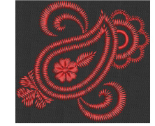
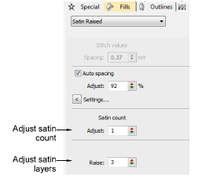
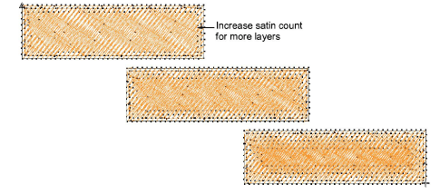

# Satin stitch count

|                    | Use Fill Stitch Types > Satin to apply satin stitch to new or selected narrow columns and shapes. Right-click for settings.                                        |
| ------------------------------------------------------------------ | ------------------------------------------------------------------------------------------------------------------------------------------------------------------ |
|        | Use Fill Stitch Types > Satin Raised to create raised surfaces – can be applied to lettering or used with trapunto for quilting effects. Right-click for settings. |
|              | Use Outline Stitch Types > Satin to create thicker borders or columns of even thickness. Right-click for settings.                                                 |
|  | Use Outline Stitch Types > Satin Raised to create raised satin borders – can be used with outlines for quilting effects. Right-click for settings.                 |

Satin Raised is often used for folk designs to mimic handmade embroidery that uses thicker thread. If you require thicker stitches, set the satin stitch to repeat itself multiple times. Use Satin Raised to create raised surfaces consisting of multiple layers of satin stitching. This can also be applied successfully to some styles of font for a raised embroidery surface.

## To adjust satin stitch count...

- Right-click the Satin icon to access object properties.

- Enter the number of repetitions in the Satin Count field.

::: warning Caution
Using a value higher than 10 may cause thread breaks, depending on the design, fabric, or thread tension.
:::

- With Satin Raised you can also adjust the number of layers of stitching.

- Press Enter or click Apply.

::: tip
When you increase satin stitch count, you should also increase the spacing to avoid bunching and thread breaks.
:::

## Related topics...

- [Satin fixed spacing](Satin_fixed_spacing)
- [Optimizing long satin stitches](../../Quality/quality/Optimizing_long_satin_stitches)
- [Applying stitch types & effects to lettering](../../Lettering/lettering_advanced/Applying_stitch_types_effects_to_lettering)
