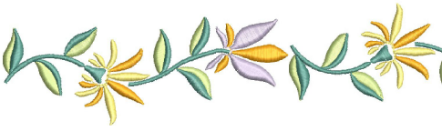

# Satin stitching

Satin is one of those stitch types which can be used for thicker borders or for fills. It is well-suited to narrow shapes where each stitch spans the width of the column. Because there are generally no needle penetrations breaking up the fill, satin stitch gives a glossy, high-quality appearance.

Tip: The [Auto Split](../../glossary/glossary) and Auto Jump features help you to control long satin stitches. [See Optimizing long satin stitches for details.](../../Quality/quality/Optimizing_long_satin_stitches)

## Related topics...

- [Applying satin stitch](Applying_satin_stitch)
- [Satin auto-spacing](Satin_auto-spacing)
- [Satin fixed spacing](Satin_fixed_spacing)
- [Satin stitch count](Satin_stitch_count)
