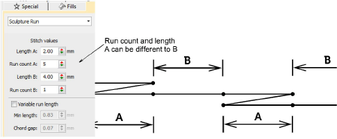

# Sculpture run settings

|  | Use Outline Stitch Types > Sculpture Run to create a thick-thin outline alternating single and triple stitches for a hand-stitched look. |
| ---------------------------------------------------------------- | ---------------------------------------------------------------------------------------------------------------------------------------- |

Sculpture Run provides independent stitch length parameters for alternating stitches. This is handy for creating a hand-stitched look. Apply to open or closed shapes. Default alternating values are equal but can be independently set – e.g. A=2.5 mm and B=1.5 mm. Also, the number of A/B repeats can be independently set. The default setting is #A=3, #B=1.

