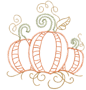

# Simple outlines

EmbroideryStudio provides tools for creating outline stitching of varying thicknesses and styles. They are typically used to add borders and pickout runs. There are tools for creating simple run stitching as well as a wide variety of decorative outlines. Outline stitch types can be interchanged.

## Related topics...

- [Simple run stitching](Simple_run_stitching)
- [Stitch length settings](Stitch_length_settings)
- [Run count setting](Run_count_setting)
- [Decorative outlines](Decorative_outlines)
