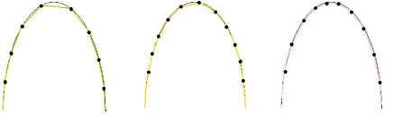
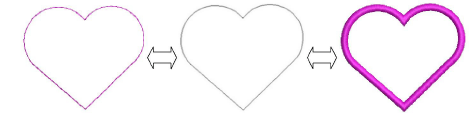

# Simple run stitching

|                              | Use Outline Stitch Types > Run to place a row of single run stitches along a digitized line. Right-click for settings.                   |
| ------------------------------------------------------ | ---------------------------------------------------------------------------------------------------------------------------------------- |
|          | Use Outline Stitch Types > Triple Run to place a triple row of run stitches along a digitized line. Right-click for settings.            |
|  | Use Outline Stitch Types > Sculpture Run to create a thick-thin outline alternating single and triple stitches for a hand-stitched look. |

Use Run to digitize lines of simple [run stitching](../../glossary/glossary). Use Triple Run for emphasis. This stitch type is typically used for thicker borders and outlines. Sculpture Run creates thick-thin alternating single and triple stitching for a hand-stitched look. Adjust [stitch length](../../glossary/glossary), chord gap, stitch repetitions, and other settings via the Object Properties docker.

## Tips for use...

- Both Traditional Digitizing and Graphics Digitizing toolbars contain tools for digitizing outlines. These tools place a row of stitching along a digitized line.
- EmbroideryStudio provides tools for automatically generating outlines.
- Use Backtrack and Repeat to reinforce outlines while specifying the direction of the stitching.
- Swap outline types at any time, including vector outlines. Vector objects of course have no stitch properties. Satin outline width can be controlled via object properties or using the Reshape tool.

## Related topics...

- [Digitizing outlines & details](../input/Digitizing_outlines_details)
- [Creating vector shapes in EmbroideryStudio](../../Automatic/vectors/Creating_vector_shapes_in_EmbroideryStudio)
- [Reinforce outlines](../../Quality/quality/Reinforce_outlines)
- [Generating outlines & offsets](../../Modifying/productivity/Generating_outlines_offsets)
- [Reshape Column C objects](../../Modifying/reshape/Reshape_Column_C_objects)
