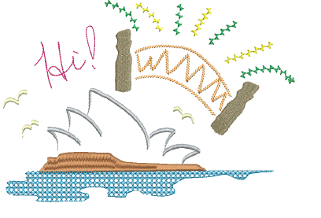

# Specialty stitching

EmbroideryStudio provides many specialty effects and stitch types to create artistic fills. These can be used to create more organic, naturalistic stitching. They can be used to create textures like feathers or wool. Use them also to create open stitching with low stitch counts. [See also Specialty Stitching.](../../Decorative/specialty/Specialty_Stitching)

Specialty stitch effects covered in the related topics below include:

| Feature                                                  | Overview          |                                                                                                                                                                                                                               |
| -------------------------------------------------------- | ----------------- | ----------------------------------------------------------------------------------------------------------------------------------------------------------------------------------------------------------------------------- |
|  | Freehand          | Create designs with a hand-drawn appearance, something which is difficult to achieve through conventional digitizing methods. [See Freehand embroidery for details.](../../Decorative/specialty/Freehand_embroidery)          |
|      | Hand Stitch       | Create hand-stitch effects which combine randomized stitch length, angle and count. [See Hand stitch effect for details.](../../Decorative/specialty/Hand_stitch_effect)                                                      |
|                  | Jagged Edge       | Create rough edges, shading effects, or imitate fur and other fluffy textures. [See Jagged edges for details.](../../Decorative/specialty/Jagged_edges)                                                                       |
|                | Stipple           | Create textured fills of run stitching which meanders more or less randomly within a border. [See Stippling effects for details.](../../Decorative/specialty/Stippling_effects)                                               |
|                      | Maze Fill         | Create maze-like stitching which follows object contours for open fills. [See Maze fills for details.](../../Decorative/specialty/Maze_fills)                                                                                 |
|                          | String            | Ideally suited to creating craftstitch fills as well as delicate borders. Can be used as a border for fixing ornamental mirrors and sequins. [See String stitching for details.](../../Decorative/specialty/String_stitching) |
|                  | Zigzag            | Create fills or open borders or columns of even width for an open ‘sawtooth’ effect. [See Decorative borders for details.](../../Decorative/specialty/Decorative_borders)                                                     |
|                        | E Stitch          | Create fills or open borders or columns of even width for an open ‘comb’ effect. [See Decorative borders for details.](../../Decorative/specialty/Decorative_borders)                                                         |
|                      | Trapunto          | Move internal travel runs to the edges of an object so that they can’t be seen through open stitching. [See Trapunto open stitching for details.](../../Decorative/specialty/Trapunto_open_stitching)                         |
|      | Accordion Spacing | Vary stitch spacing between dense and open fill, producing gradient and shading effects. [See Accordion spacing for details.](../../Decorative/specialty/Accordion_spacing)                                                   |
|            | Color Blending    | Like Accordion Spacing but used to create color blends where two colors are merged from one to another using a mixture of dense and open fill. [See Color blends for details.](../../Decorative/specialty/Color_blends)       |
|                              | Chenille          | Incorporate stitch patterns traditionally associated with chenille work – Square, Double Square, Coil, and Island Coil. [See Chenille patterns for details.](../../Decorative/specialty/Chenille_patterns)                    |
|        | Cross Stitch      | Fill large areas with cross stitching on an invisible grid that applies to all design objects. [See Cross stitch fills for details.](../../Decorative/specialty/Cross_stitch_fills)                                           |
