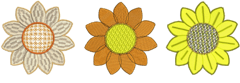

# Stitch Types

All [embroidery objects](../../glossary/glossary) in EmbroideryStudio contain defining settings or [properties](../../glossary/glossary). Some, such as size and position, are common to all objects, while others are specific to object type. The most important property of all is stitch type. The software uses object outlines and the associated stitch type to generate stitches. Whenever you reshape, transform or [scale](../../glossary/glossary) an object, stitches are regenerated according to current settings.

Stitch types divide broadly into two categories – outlines and fills. Different stitch types suit different shapes. Some stitch types are suitable for both outlines or fills. Others are dedicated to one or other purpose. A stitch type can be selected together with a digitizing method or applied afterwards. Whenever you create an object from scratch, it takes the currently selected stitch type.

## Related topics...

- [Simple outlines](Simple_outlines)
- [Satin stitching](Satin_stitching)
- [Tatami stitching](Tatami_stitching)
- [Decorative embroidery](Decorative_embroidery)
