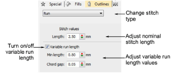
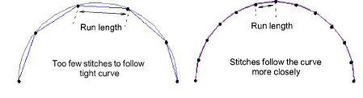
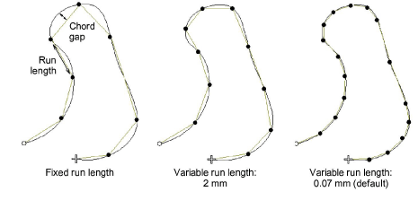

# Stitch length settings

|  | Use Outline Stitch Types > Run to place a row of single run stitches along a digitized line. Right-click for settings. |
| ------------------------------------ | ---------------------------------------------------------------------------------------------------------------------- |

For run stitch and other outline stitches, [stitch length](../../glossary/glossary) can be adjusted to suit the shape.

## To adjust stitch length...

- Right-click the icon to access object properties.

- To set a fixed stitch length, adjust the Length field. For sharp curves, reduce length – e.g. 1.8 mm – so that the stitches follow the line more closely. Mimic hand-made embroidery by increasing length to, say, 4.0 mm.

- Alternatively, automatically shorten stitches to follow tight curves with the Variable Run Length option.
- In the Chord Gap field, enter the maximum distance to allow between the digitized outline and the stitches.

- In the Min Len field, enter the [minimum stitch length](../../glossary/glossary) to allow. Stitch length will not reduce to less than this value, even if the chord gap is exceeded.
