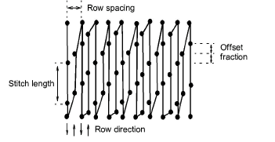
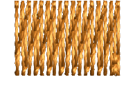
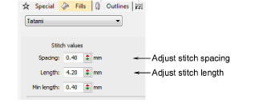
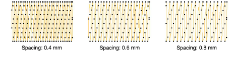
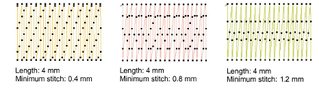

# Tatami density

|        | Use Fill Stitch Types > Tatami to create fills for larger irregular shapes. Right-click for settings.                   |
| ---------------------------------------------- | ----------------------------------------------------------------------------------------------------------------------- |
|  | Use Outline Stitch Types > Tatami to create borders or columns of even width for different needle penetration patterns. |

Tatami stitch density is determined by the distance between each row of stitches. Sometimes row spacing is increased to create more open stitching for backgrounds and special effects.

Tip: When you increase stitch spacing, Auto Underlay should be turned off. If too open, you may also find that [travel runs](../../glossary/glossary) and overlapping segments spoil the effect. The Trapunto effect automatically moves underlying travel runs to the edges of an object so that they can’t be seen.

## To set tatami density...

1Select the digitizing method you want to use – e.g. Complex Turning.

2Select Tatami and create an [embroidery object](../../glossary/glossary). Alternatively, select an existing embroidery object and click Tatami.

3Right-click the Tatami icon to access object properties.

4Adjust Spacing as required. For increased density, enter a smaller value. For more open stitching, enter a larger value.

5Adjust Length as required.

6In the Min length field, enter the length of the shortest stitch to be generated.

7Adjust other settings as desired.

8Press Enter or click Apply.

## Related topics...

- [Embroidery digitizing](../input/Embroidery_digitizing)
- [Object property apply options](../../Setup/settings/Object_property_apply_options)
- [Trapunto open stitching](../../Decorative/specialty/Trapunto_open_stitching)
