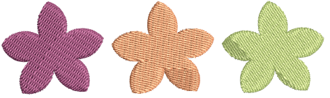

# Tatami stitching

Tatami stitch consists of rows of run stitches and is suitable for filling large shapes. Stitch offsets in each row are used to eliminate horizontal split lines.

## Related topics...

- [Tatami density](Tatami_density)
- [Other tatami settings](Other_tatami_settings)
