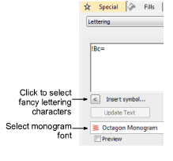
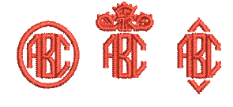
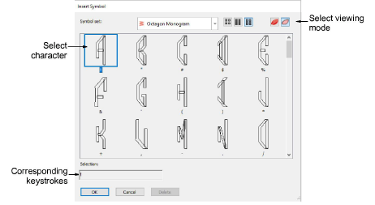
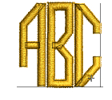
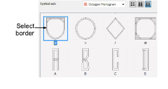
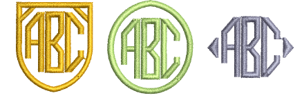
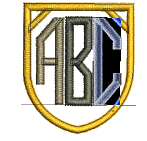

# Add monogram lettering

In addition to the dedicated Monogramming feature, EmbroideryStudio allows you to create monogramming designs using special monogram fonts. [See also Monogramming.](../lettering_monograms/Monogramming)

## To add monogram lettering...

1. Right-click the Lettering icon to access object properties.

2. Select a suitable monogram font such as Octagon Monogram. [See also Standard Fonts.](../../Management/sample_fonts/Standard_Fonts)

3. Click Insert Symbol. The Insert Symbol dialog opens.

Tip: When you select a character, a keystroke appears in the Selection field. This indicates the key combination required to type the character directly on-screen.

4. Select a left-facing letter. Octagon Monogram, for example, has three sets of each letter, one for the left side, one for the middle and one for the right side. When selecting letters, you need to ensure letter orientation is correct.

5. Select a middle letter and then a right-facing letter.

6. Select a border if required.

7. Click OK. The selected characters are displayed in the text entry panel.

8. Click Create Text.

Tip: If you want the letters in your monogram to be different colors, select and recolor one-by-one.

## Related topics...

- [Insert symbols](Insert_symbols)
- [Create flair script designs](Create_flair_script_designs)
- [Use the Character Map](Use_the_Character_Map)
