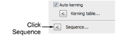
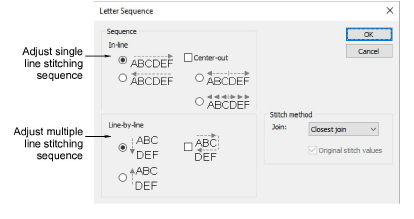
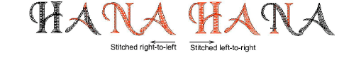
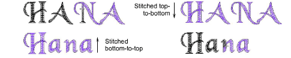

# Adjust letter sequencing

|  | Click Toolbox > Lettering to adjust the lettering stitching sequence. |
| ------------------------------------------------ | --------------------------------------------------------------------- |

You can specify the sequence in which letters are stitched to minimize registration problems such as on caps or difficult fabrics. For example, the Center Out option is especially useful when stitching on caps. There are also options for multiple lines of lettering which are useful for machines without trimmers.

## To adjust letter sequencing...

1. Right-click the Lettering icon or double-click selected lettering object/s to access object properties.

2. Click Sequence. The Letter Sequence dialog opens.

3. Select a stitching sequence. Options include:

- In-line: Select whether you want the lettering to be stitched left-to-right or right-to-left in each line.

- Center-out: Select this checkbox if you want the lettering stitched from center out.

- Line-by-line: Choose whether you want multiple lines to stitch top-to-bottom or bottom-to-top.

Note: You can combine both In-line and Line-by-line sequencing options.

4. Click OK to return to the Special tab.

Tip: Travel through your design to check the stitching sequence. [See Travel through designs for details.](../../Basics/view/Travel_through_designs)
