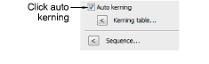

# Apply automatic kerning

|  | Right-click Toolbox > Lettering to adjust automatic kerning for selected lettering objects. |
| ------------------------------------------------ | ------------------------------------------------------------------------------------------- |

The automatic kerning option is accessed by means of the Object Properties docker.

## To apply automatic kerning...

1. Double-click a lettering object to access object properties.

2. Scroll down to the Spacing panel. If a kerning table exists for the selected embroidery font or TrueType font, the Auto Kerning checkbox is enabled and selected by default.

3. Select Auto Kerning as required and click Apply.

## Related topics...

- [Setting automatic letter spacing](Setting_automatic_letter_spacing)
