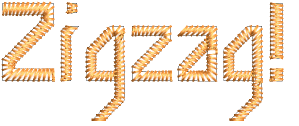
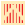

# Applying stitch types & effects to lettering

By default, lettering objects are filled with Satin stitch. You can apply other fill stitch types such as Tatami or Program Split as well as stitch effects such as Jagged Edge. [See Stitch Types for details.](../../Digitizing/stitches/Stitch_Types)

Note: Lettering values are stored in the &lt;PRESET_LETTERING&gt; style in the Normal template. Changing these does not affect the values of other objects. Do not delete or rename this style. [See Working with styles for details.](../../Digitizing/properties/Working_with_styles)

## Satin lettering

|              | Use Fill Stitch Types > Satin to apply satin stitch to new or selected narrow columns and shapes. Right-click for settings.                                        |
| -------------------------------------------------- | ------------------------------------------------------------------------------------------------------------------------------------------------------------------ |
|  | Use Fill Stitch Types > Satin Raised to create raised surfaces – can be applied to lettering or used with trapunto for quilting effects. Right-click for settings. |

By default, lettering objects are filled with Satin stitch. Because there are generally no needle penetrations breaking up the fill, satin stitch creates a glossy, high-quality effect suitable for most lettering.

Satin Raised can be applied successfully to some styles of font for a raised embroidery surface. Outlines can be added with the Outlines & Offsets tool for use with quilted designs. Traditionally, trapunto utilizes two or more layers, the underside of which is slit and padded, producing a raised surface on the quilt. Lay the second layer over Satin Raised lettering and stitch down with trapunto outlines.

Note: EmbroideryStudio also includes as standard a number of dedicated 3D fonts.

## Related topics...

- [Satin stitching](../../Digitizing/stitches/Satin_stitching)
- [Standard Fonts](../../Management/sample_fonts/Standard_Fonts)
- [Generating outlines & offsets](../../Modifying/productivity/Generating_outlines_offsets)

## Tatami lettering

|  | Use Fill Stitch Types > Tatami to create fills for larger irregular shapes. Right-click for settings. |
| ---------------------------------------- | ----------------------------------------------------------------------------------------------------- |

You can fill lettering shapes with Tatami stitching. This may be suitable for filling larger lettering shapes.

## Zigzag lettering

|  | Use Fill Stitch Types > Zigzag to create fills with an open ‘sawtooth’ effect. Right-click for settings. |
| ---------------------------------------- | -------------------------------------------------------------------------------------------------------- |

Zigzag stitch can be applied to lettering for any open stitching effect.

## Related topics...

- [Open stitching](../../Decorative/specialty/Open_stitching)
- [Standard Fonts](../../Management/sample_fonts/Standard_Fonts)

## Patterned lettering

|  | Use Fill Stitch Types > Program Split to create decorative fill stitches where needle penetrations form a tiled pattern. |
| -------------------------------------------- | ------------------------------------------------------------------------------------------------------------------------ |

Try applying Program Split to lettering. This too may be suitable for filling larger lettering shapes or for special effects. Density is determined by stitch spacing.

## Related topics...

- [Creating textures with program splits](../../Decorative/patterns/Creating_textures_with_program_splits)

## Jagged edge lettering

|  | Use Stitch Effects > Jagged Edge to create rough edges, shading effects, or imitate fur and other fluffy textures along one or more sides of selected objects. |
| ---------------------------------------- | -------------------------------------------------------------------------------------------------------------------------------------------------------------- |

Jagged Edge can be used with lettering objects for special ‘spooky’ effects or fluffy textures.

## Related topics...

- [Jagged edges](../../Decorative/specialty/Jagged_edges)
