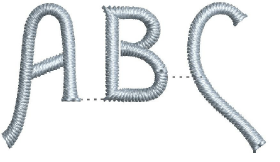
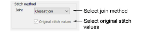
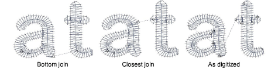
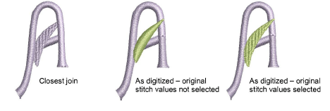

# Change lettering join method

|  | Use Toolbox > Lettering to change the lettering join stitch method. |
| ------------------------------------------------ | ------------------------------------------------------------------- |

The lettering stitch method is preset to give the best results for each font. In most cases, Closest Join is recommended in order to minimize trims.

Lettering objects normally consist of one stitch type and one color only. However, the As Digitized join method together with Original Stitch Values setting can be used with special fonts which combine several stitch types – e.g. Satin with Run, or Tatami, or Motifs. The As Digitized setting can also be used with fonts which include multiple colors or special effects. Such fonts may include [machine functions](../../glossary/glossary), as for two-color fonts, or run stitches as part of the cover stitching.

## To change the lettering join method...

1Right-click the Lettering icon or double-click selected lettering object/s to access object properties.

2Click Sequence. The Letter Sequence dialog opens.

3Select a stitch method from the droplist:

Options include:

| Option       | Function                                                                                                                                    |
| ------------ | ------------------------------------------------------------------------------------------------------------------------------------------- |
| Bottom join  | Letters are joined along the baseline. Use it when stitching on towelling – joins are hidden in the pile.                                   |
| Closest join | Letters are joined at the closest point. Use it to minimize trims.                                                                          |
| As digitized | Letters are joined the same way they were originally digitized. Use it with fonts combining different fill stitch types or special effects. |

4Select the Original stitch values checkbox as required.

This setting is only available if the As Digitized join type is selected. Use it with special fonts which combine several stitch types. If not selected, these letters will be stitched with a single stitch type.

5Click OK to return to the Special tab.

Note: For recommended stitch and join methods, see [Standard Fonts](../../Management/sample_fonts/Standard_Fonts).
