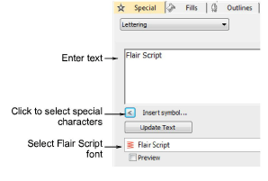

# Create flair script designs

|  | Use Toolbox > Lettering to add special characters and symbols. Right-click to select lettering options. |
| ------------------------------------------------ | ------------------------------------------------------------------------------------------------------- |

Flair script is a special font which allows you to add decorative flairs to the end of text objects, mimicking flamboyant handwriting flourishes.

## To create a flair script design...

1. Right-click the Lettering icon to access object properties.

2. Select Flair Script from the Font list.

3. Enter the text you want to embroider in the text entry panel.

4. Click Insert Symbol.

5. Select the flourish you want to use. Scroll down for more options.

6. Click OK to close the dialog. The selected characters are displayed in the text entry panel.

7. Adjust lettering settings as required and click OK.

8. Click an insertion point or mark reference points for the selected baseline.

9. Press Enter.

::: tip
Experiment with different flourishes to obtain the look you want.
:::

## Related topics...

- [Insert symbols](Insert_symbols)
- [Add monogram lettering](Add_monogram_lettering)
- [Use the Character Map](Use_the_Character_Map)
