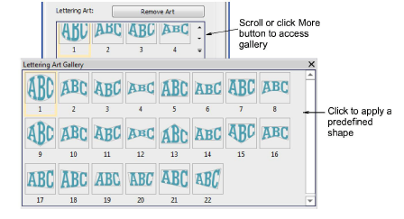
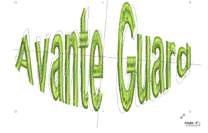
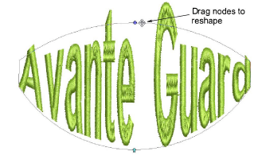
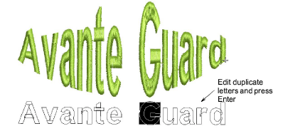
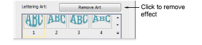

# Creating special effects with lettering art

|  | Use Toolbox > Lettering to edit letters on-screen.                                   |
| ------------------------------------------------ | ------------------------------------------------------------------------------------ |
|    | Use Reshape > Reshape Object to reshape selected objects by means of control points. |

Apply Lettering Art effects to make letters bulge or arch, stretch or compress. Many styles are available from the Lettering Art gallery. You can fine-tune preset shapes as preferred. Edit lettering text in envelopes the same way as normal lettering. Return lettering to its original shape by removing the envelope altogether.

## To create lettering art effects...

- Create a lettering object.

- Double-click the object to access its properties.
- Scroll through the Lettering Art list or click More to access the gallery. You can tear it off for easy access.

- Select a shape from the gallery.

- Click again to access rotation control handles.

- Use Reshape Object to fine-tune the envelope shape.

- Drag control handles to adjust:
- To move two handles in opposite directions, hold Shift while dragging.
- To move handles in the same direction, hold Ctrl while dragging.
- Press Esc to finish.
- To edit, click the Lettering icon with the object selected. Duplicate letters appear below.

- Click inside the duplicate and edit text as desired. Press Enter to confirm.

- To return an object to its original shape, click Remove Art.

## Related topics...

- [Applying envelopes](../../Modifying/reshape/Applying_envelopes)
