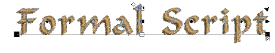
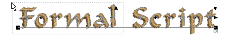

# Edit kerning values

|  | Use Reshape > Reshape Object to reshape selected objects, edit stitch angles, and adjust start/end points. |
| -------------------------------------------------------- | ---------------------------------------------------------------------------------------------------------- |

You have created a lettering object which has Auto Kerning toggled on. Use this procedure to update kerning settings for contiguous pairs of letters.

## To edit kerning values...

1. Select a lettering object with automatic kerning and click the Reshape icon.

2. Click the diamond control point in the center of the letter.

3. Drag selected letter/s along the baseline or use arrow keys to adjust the spacing. Alternatively, to move multiple letters, right-click the diamond control point of the first letter and drag. All letters to the end of the line move as one.

4. Repeat as many times as necessary to fine-tune all letter spacings in the object.

5. Select one or more blocks of contiguous letters by Ctrl\-clicking their diamond control points or dragging a selection box around them.

6. Select Object > Update Kerning Settings. The operation will affect letter spacing of all new lettering objects.

7. Click OK.

A new kerning value is generated for each contiguous pair of letters, and written to the associated kerning table.

## Related topics...

- [Adjust letter spacings on-screen](../lettering_create/Adjust_letter_spacings_on-screen)
