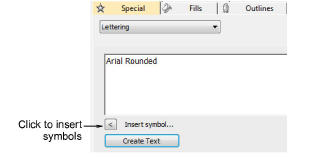
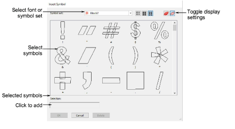

# Insert symbols

|  | Use Toolbox > Lettering to add special characters and symbols. Right-click to select lettering options. |
| -------------------------------------- | ------------------------------------------------------------------------------------------------------- |

Add special characters and symbols to your lettering designs.

## To insert symbols...

1. Right-click the Lettering icon to access object properties.

Tip: If you already know the keyboard shortcut for a symbol, you can add it by entering the combination on screen or in the docker.

2. Click Insert Symbol.

3. Select a font or symbol set from the Symbol set list.

4. Select the symbols you want to use. Selected symbols are displayed in the Selection field.

5. Click OK. The selected symbols are displayed in the text entry panel of the Object Properties > Special > Lettering docker.

## Related topics...

- [Create flair script designs](Create_flair_script_designs)
- [Add monogram lettering](Add_monogram_lettering)
- [Use the Character Map](Use_the_Character_Map)
