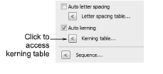
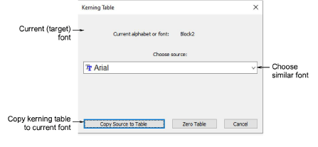

# Manage kerning tables

|  | Use Docker > Object Properties to access kerning tables. |
| ---------------------------------------------------- | -------------------------------------------------------- |

A kerning table is an array of kerning values for every possible pair of letters in the font. The Kerning Table command accesses a dialog used to manage kerning tables. You can copy tables from one font – embroidery or TrueType – to another or remove its kerning table altogether.

::: info Note
TrueType kerning tables cannot be replaced, added to, or modified in any way. You can, however, convert a TrueType font to an embroidery font and add or modify a kerning table as required.
:::

## To manage kerning tables...

1. Open the Object Properties > Special > Lettering docker.

2. Select a font from the droplist.

3. Scroll down and click the Kerning Table button. The Kerning Table dialog opens with the current (target) embroidery font displayed. The droplist displays all fonts that contain kerning tables.

4. Choose a suitable font or TrueType font from the list and click Copy Source to Table to load its kerning table to the current embroidery font.

The Zero Table command is enabled if the current (target) font already has a kerning table.

## Related topics...

- [Apply automatic kerning](Apply_automatic_kerning)
- [Edit kerning values](Edit_kerning_values)
