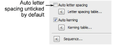

# Setting automatic letter spacing

The Auto Letter Spacing feature allows you to fine-tune letter spacing according to the number of characters per lettering object. When activated, EmbroideryStudio automatically spaces letters according to a predefined spacing table. For example, in a five-character lettering object, spacing may be set to 2mm, while in a three-character lettering object, it may be increased to, say, 3mm.

## To apply automatic letter spacing...

1. Create or select a lettering object and double-click to access object properties.

2. Select a baseline for use with Auto Letter Spacing. Automatic letter spacing is available for all baselines. However, with fixed-line and arc baselines, automatic spacing only works with Width and Size options selected.

3. Tick the Auto Letter Spacing checkbox.

4. Click the Letter Spacing Table button. The Letter Spacing Table dialog contains a matrix of settings for lettering objects of two to six or more characters.

5. Adjust spacings for each character grouping. The topmost field for two characters has a range of 0.10mm to 100.00mm.

6. Click OK. With the Auto Letter Spacing checkbox checked:

- For a lettering object with more than one line of text, the system will use the longest line of text for the letter spacing.

- The letter spacing table will not change even if individual letters are resized in Reshape mode.

::: tip
The Auto Letter Spacing feature also works with the Team Names feature. Any ‘name frame’ can have a specified letter spacing just as it can assume any other lettering property.
:::

## Related topics...

- [Setting automatic letter kerning](Setting_automatic_letter_kerning)
- [Adjusting baselines](../lettering_edit/Adjusting_baselines)
- [Creating simple teamname designs](../lettering_names/Creating_simple_teamname_designs)
