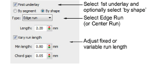
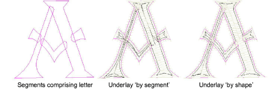
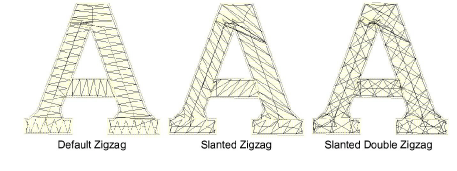

# Setting lettering underlay

|  | Right-click Stitch Effects > Auto Underlay to adjust lettering underlay settings. |
| -------------------------------------------- | --------------------------------------------------------------------------------- |

Lettering appearance and quality depends a lot on underlay which serves as a foundation for cover stitching. As well as stabilizing, underlay also provides ‘loft’, raising cover stitches and preventing them from sinking into soft fabrics. It can also prepare a napped fabric by flattening it.

Most lettering used in designs is 15 mm high or less. The columns at such sizes are less than 3 mm wide for normal – not heavy or block – fonts. Such objects are best served with a single Center Run or Edge Run underlay. Here are a few rules of thumb:

- Lettering with heights under 5 mm should not have underlay.
- Letters 6 mm to 10 mm can have a center-run underlay applied.
- Lettering larger than 10 mm is large enough for edge-run underlay.
- Large letters for jacket backs and so on can use a second layer of underlay. Double-zigzag is sometimes used to give added loft.

## To set lettering underlay...

1Select a lettering object.

2Right-click the Auto Underlay icon to access object properties.

3Select the First Underlay checkbox and select Center Run or Edge Run as the first underlay type. If you select Edge Run, a further By Shape option becomes available. When activated, underlay is applied to the lettering object as a whole.

4Select the By Segment or By Shape option as required.

Note: With most embroidery objects, underlay is stitched segment-by-segment before cover stitches are sewn. Lettering underlay, however, defaults to a single By Shape > Edge Run underlay, except ‘As Digitized’ lettering. This has the effect of calculating an underlay for the entire shape rather than each segment comprising it. This in turn reduces bunching, travel runs, and overall stitch count.

5Enter the required length values for each underlay type.

6If you are using zigzag underlay, adjust stitch angles to create a ‘cross-hatch’ effect. This may provide more support than single zigzag.

7Press Enter or click Apply.

Tip: Run Stitch Player to see how the underlay will stitch out.

## Related topics...

- [Run stitch underlay settings](../../Quality/underlays/Run_stitch_underlay_settings)
- [Zigzag underlay settings](../../Quality/underlays/Zigzag_underlay_settings)
- [Simulate design stitchouts](../../Basics/view/Simulate_design_stitchouts)
