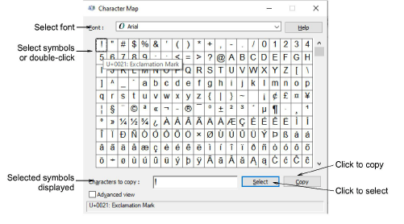

# Use the Character Map

Use the MS Windows® Character Map to provide quick access to common symbols and letters. The Character Map is usually installed as part of the MS Windows® setup. See your MS Windows® documentation for more details.

## To use the Character Map...

1Open the MS Windows® Character Map. By default, you will find it under Start > Programs > Accessories > System Tools > Character Map.

2Select a font from droplist.

3Double-click a character, or select it and press Select. The character/s appear in the Characters to copy field.

4Click Copy to copy the character to the [clipboard](../../glossary/glossary).

5Paste it into the text entry panel of the Object Properties > Special > Lettering docker. To do this, click inside the text entry panel and press Ctrl+V or right-click to open the popup menu.

Tip: You can also paste characters and symbols into an external graphics program to use as the basis for creating your own custom characters.

## Related topics...

- [Insert symbols](Insert_symbols)
- [Create flair script designs](Create_flair_script_designs)
- [Add monogram lettering](Add_monogram_lettering)
