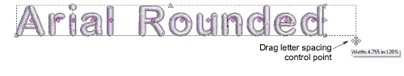
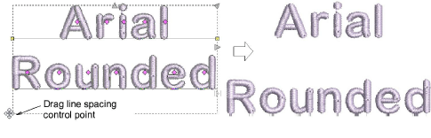
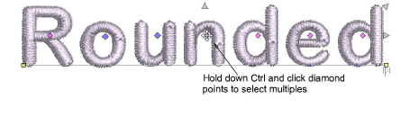
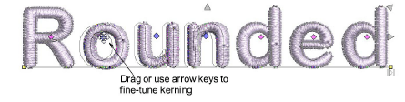

# Adjust letter spacings on-screen

|  | Use Reshape > Reshape Object to change letter spacing. |
| ---------------------------------------------- | ------------------------------------------------------ |

Spacing between letters is calculated automatically as a percentage of letter height. In most cases the [default](../../glossary/glossary) spacing is adequate. Sometimes you may want to control the overall letter spread to fit a particular location. Similarly, you can change the space between lines in a multiple-line lettering object using the Reshape Object tool. Sometimes spacing between certain letters may appear too large or too small, depending on the shape of neighboring letters. To compensate for this visual effect, you can move one or several selected letters closer or further apart along the baseline to improve spacing.

## To adjust letter spacings on-screen...

- Select the lettering object and click the Reshape Object icon.

- Drag the letter spacing control point left or right to adjust the spacing of all letters along the baseline.

- Release the mouse button to complete and press Esc.

::: tip
When the justification setting is Full, letters are evenly distributed along the baseline. To change the spacing for fully justified lettering, simply change the length of the baseline.
:::

- Drag the line spacing control point up or down to change line spacing.

- Release the mouse button to complete and press Esc.
- Click the diamond control point in the center of the letter. To select multiple letters or a range of letters, hold down Ctrl or Shift as you select.

- Drag selected letter/s along the baseline or use arrow keys to adjust the spacing.

::: tip
Alternatively, to move multiple letters, right-click the diamond control point of the first letter and drag. All letters to the end of the line move as one.
:::

- Release the mouse button to complete and press Esc.

## Related topics...

- [Setting automatic letter kerning](../lettering_advanced/Setting_automatic_letter_kerning)
- [Setting automatic letter spacing](../lettering_advanced/Setting_automatic_letter_spacing)
- [Adjusting individual letters](../lettering_edit/Adjusting_individual_letters)
