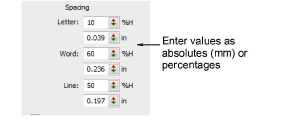

# Adjust spacing settings

You can adjust letter, word and line spacings via object properties.

## To adjust spacing settings...

- Double-click a selected lettering object or right-click the Lettering icon to access object properties.

- Enter Spacing values as absolute values (mm) or percentages of the height.
- Letter Spacing: the space between letters.

- Word Spacing: the space between words.

- Line Spacing: the space between lines.

::: tip
If you want to remove spacing between words, set Word Spacing to 0%.
:::
