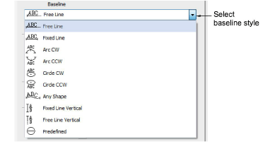
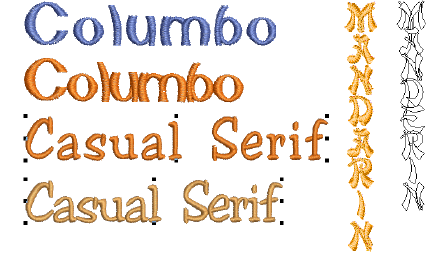
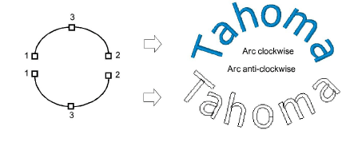
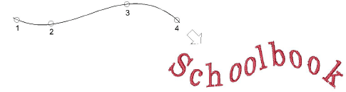
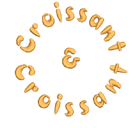

# Apply baselines

|  | Right-click Toolbox > Lettering to select baselines and adjust baseline settings. |
| ------------------------------------------------ | --------------------------------------------------------------------------------- |

With the exception of Free Line and Free Line Vertical, baselines allow you to set the final length of the finished lettering. Once you have placed a baseline, EmbroideryStudio attempts to fit all the letters without altering baseline length. EmbroideryStudio gives you interactive and numeric control over many baseline settings.

## To apply a baseline...

- Double-click a selected lettering object or right-click the Lettering icon to access object properties.

- Select a baseline from the list. Options include:
- Horizontal – Free Line and Fixed Line
- Vertical – Free Line Vertical and Fixed Line Vertical

Fixed Line baselines allow you to set the final length of the finished lettering. Free Line baselines expand to fit the letters you enter.

With vertical baselines, line spacing is calculated horizontally while letter spacing is calculated vertically. Letters, by default, are centered along vertical lines. New lines are placed by default from right to left to suit Asian languages. For Western languages, vertical lettering is best suited to uppercase because descenders in lowercase letters are not accommodated in the letter spacing.

- Arc – Arc CW and Arc CCW: By default, letters are positioned above the Arc CW and below the Arc CCW baseline. They are also centered by default. Hold down the Ctrl key to constrain the line to 15° increments.

Depending on the order in which you mark the reference points, the text will be placed left to right, or right to left.

- Circle – Circle CW and Circle CCW: Place letters around a full circle or oval. Mark a point on the circumference to define the radius. Mark a third point to define an ellipse or press Enter directly for a perfect circle. Hold down the Ctrl key to constrain the line to 15° increments.

Tip: Adjust circle and arc baseline settings for more precise numeric control over radius (X and Y), as well as tilt, justification, and arc angles.

- Custom: Digitize Any Shape baselines by marking reference points to form the required line. The number of reference points and length of baseline are practically unlimited.

Tip: If the baseline has tight curves, or sharp corners, letters may overlap. For best results, only mark curve points and digitize lines which have shallow, gentle curves.

- Predefined: This technique is typically used for creating logos.

- Adjust baseline settings in the Baseline Settings dialog.

## Related topics...

- [Adjust fixed-width baseline settings](../lettering_edit/Adjust_fixed-width_baseline_settings)
- [Adjust curved baseline settings](../lettering_edit/Adjust_curved_baseline_settings)
- [Use predefined baselines](Use_predefined_baselines)
- [Adjusting baselines](../lettering_edit/Adjusting_baselines)
