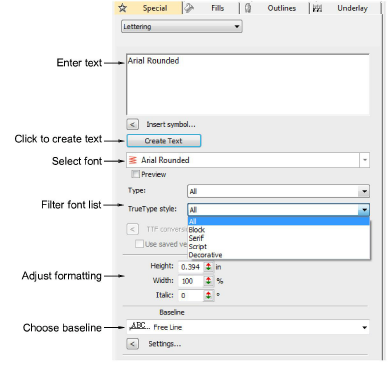
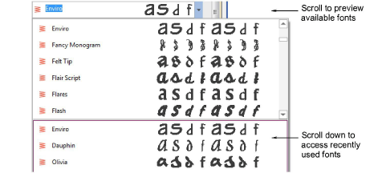
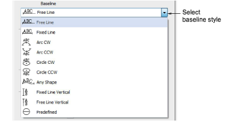

# Create lettering with object properties

|  | Right-click Toolbox > Lettering to enter text in the docker and adjust settings for embroidery lettering. |
| ------------------------------------------------ | --------------------------------------------------------------------------------------------------------- |

Using the Object Properties docker, you can specify letter formatting before adding it to the design. This is the more traditional method and is useful with more complex designs. EmbroideryStudio provides a font range suitable for many applications. Select from the supplied embroidery fonts or convert TrueType or OpenType fonts installed on your system.

## To create lettering with object properties...

1Right-click the Lettering icon to access object properties.

2Enter the text you want to embroider in the text entry panel. To start a new line, press Enter.

3Select a font from the Font droplist. To filter the list:

- Choose a font type: Embroidery, TrueType, or All.
- Choose a TrueType font style: Block, Serif, Script, Decorative, or All. These only apply to TrueType fonts.
- Type two (or more) characters of the font name to further filter the list.

Tip: Check min/max recommendations for each font and stay within them for best results. [See Standard Fonts for details.](../../Management/sample_fonts/Standard_Fonts)

4Select a baseline from the droplist. Baselines determine the shape of lettering objects in a design.

5Click Create Text in the docker.

6Click on screen to place the lettering, or mark reference points for the selected baseline.

7Press Enter to generate. Letters are filled with stitches according to current settings in the Object Properties docker. Change these at any time.

Tip: Lettering appearance and quality depends a lot on underlay which serves as a foundation for cover stitching.

## Related topics...

- [Select embroidery fonts](Select_embroidery_fonts)
- [Standard Fonts](../../Management/sample_fonts/Standard_Fonts)
- [Working with baselines](Working_with_baselines)
- [Format lettering](Format_lettering)
- [Setting lettering underlay](../lettering_advanced/Setting_lettering_underlay)
- [Converting TrueType fonts to embroidery](../lettering_custom/Converting_TrueType_fonts_to_embroidery)
