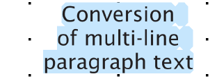
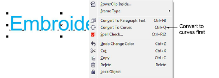

# Creating lettering with CorelDRAW Graphics

|              | Use Mode > Tag Fill as Turning Satin to tag narrow shapes for conversion to turning stitching.                       |
| -------------------------------------------------------------------------- | -------------------------------------------------------------------------------------------------------------------- |
|  | Use Mode > Convert Graphics to Embroidery to convert selected graphics to embroidery and switch to Wilcom Workspace. |

Some EmbroideryStudio product levels include CorelDRAW® Graphics Suite as standard. This allows you to add and format TrueType lettering in CorelDRAW Graphics. This can then be converted to either embroidery lettering or embroidery objects.

Note: For a detailed description of the CorelDRAW® Graphics Suite interface, access the Help menu in CorelDRAW Graphics mode.

## To create lettering with CorelDRAW Graphics...

1Switch to CorelDRAW Graphics.

2Create a CorelDRAW® Graphics Suite text object and select it.

3Click Convert Graphics to Embroidery. Wilcom Workspace opens in a few moments and the converted embroidery lettering displays. Change to a native embroidery font and adjust settings as desired.

- You can create lettering along any shape of baseline in CorelDRAW Graphics and convert to embroidery lettering.

- You can also convert multi-line paragraph text with left, center, or right justification.

Tip: If you are not satisfied with the results of lettering conversion and want to preserve the precise appearance of the original text, try converting to curves first and then to plain embroidery. Right-click and select Convert to Curve. Optionally, use Tag Fill as Turning Satin to tag letters for conversion to turning stitching.

## Related topics...

- [Operating modes](../../Basics/basics/Operating_modes)
- [Editing text](../lettering_edit/Editing_text)
- [Adjusting baselines](../lettering_edit/Adjusting_baselines)
