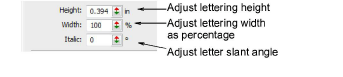
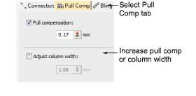

# Format lettering

Change current formatting settings before or after adding lettering. You can slant letters to left or right for an italic effect. Use the justification setting – left, right, center, or fully justified – to align lettering along the baseline.

## To format lettering...

1. Create a new lettering object and select it.

2. If not already open, double-click to open the Object Properties > Special > Lettering dialog.

3. Adjust lettering height and width using the slider controls.

Tip: Say, for example, you are using the metric measurement system so your lettering heights are in mm. And say you get an order for ¾" lettering. Simply enter ‘3/4in’ or ‘3/4 in’ into the Lettering Height field and it is automatically converted to 19.05mm.

4. Enter an angle, ±45°, in the Italic field to create slanted lettering – 0° is equivalent to no italics.

5. Select a justification setting as required – Left, Right, Center, or Full.

Tip: When the justification setting is Full, letters are evenly distributed along the baseline. To change spacing for fully justified lettering, simply change baseline length.

6. To make bold lettering, select the Pull Comp tab.

7. Select column width or pull comp options as required.

## Related topics...

- [Create lettering with object properties](Create_lettering_with_object_properties)
- [Creating special effects with lettering art](../lettering_advanced/Creating_special_effects_with_lettering_art)
- [Set measurement units](../../Basics/basics/Set_measurement_units)
- [Compensating for fabric stretch](../../Quality/underlays/Compensating_for_fabric_stretch)
