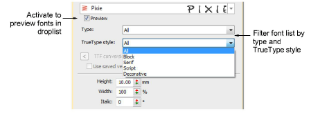
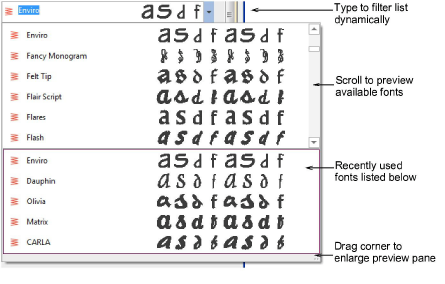
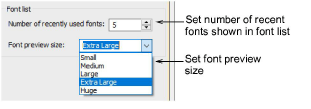
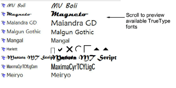
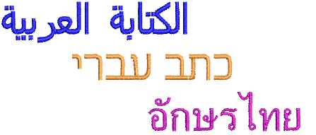
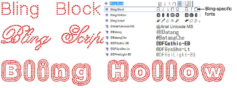

# Select embroidery fonts

EmbroideryStudio offers a range of purpose-built embroidery fonts optimized for embroidery design work. Tick the Preview checkbox for a preview of fonts prior to selection.

Use the droplists to filter the font list by type and by TrueType style:

- Choose a font type: Embroidery, TrueType, or All.
- Choose a TrueType font style: Block, Serif, Script, Decorative, or All. These only apply to TrueType fonts.

## Font selection

The font list remembers the previously selected font, allowing you to continue searching from this point.

- First up, the font list provides a preview of recently used fonts. This can be adjusted.
- With no lettering object selected, the preview displays the name of the font. Otherwise, it will show the selected text.
- If you know what you are looking for, simply start typing the font name and the list will update dynamically.
- The preview pane can be enlarged as necessary.

## Font list settings

You can set the size of your font preview via the Options > General tab. You can also adjust the number of recently used fonts.

## Conversion of TrueType and OpenType fonts

In addition to dedicated embroidery fonts, EmbroideryStudio also converts any TrueType or OpenType font on your system on-the-fly into an embroidery font. This is an important feature for Asian fonts which may contain several thousand characters.

The process is automatic. The result is similar to manually digitized fonts although the quality may not be quite as good. It depends on the original shapes. Narrower serif type fonts produce better results than blocked fonts. [See also Converting TrueType fonts to embroidery.](../lettering_custom/Converting_TrueType_fonts_to_embroidery)

## Support for complex text layouts

EmbroideryStudio provides support for ‘complex text layout’ (right-to-left) and non-European scripts including Arabic, Hebrew, and Thai. With ‘RTL languages’ like Arabic and Hebrew, the order of characters is correctly rendered in the generated lettering objects. Complex text rendering is also supported in other languages which include combined characters. [See also Converting TrueType fonts to embroidery.](../lettering_custom/Converting_TrueType_fonts_to_embroidery)

::: tip
It is also possible to select TrueType fonts in CorelDRAW® Graphics Suite and convert them on-the-fly via Convert tool.
:::

## Recommended sizes

For best results when stitching, do not exceed the recommended maximum or minimum sizes. Note, however, that recommended heights refer to UPPER CASE letters. Most embroidery fonts are digitized from an original TrueType Font (TTF), some of which have lower-case letters – e.g. ‘a’ and ‘c’ – which are about 70% the height of a capital letter. As a result, these letters may be too small to embroider neatly. You may need to increase the size of lower-case characters to suit the embroidery.

## Special characters

You can create special characters in each font by holding down the Alt key on your keyboard and typing 0 (zero), its code, using the numbers on the keypad. For example, to type ê with the code 234, type Alt+0234. The accented letter will appear when you release the Alt key. Not all characters are available in all fonts.

## Bling lettering

EmbroideryStudio also provides dedicated Bling Lettering.

## Related topics...

- [Adjust dimensions](../lettering_edit/Adjust_dimensions)
- [General options](../../Setup/settings/General_options)
- [Creating lettering with CorelDRAW Graphics](Creating_lettering_with_CorelDRAW_Graphics)
- [Adding special characters](../lettering_advanced/Adding_special_characters)
- [Creating bling lettering](../../Applied/bling/Creating_bling_lettering)
- [Standard Fonts](../../Management/sample_fonts/Standard_Fonts)
