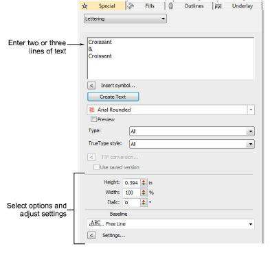
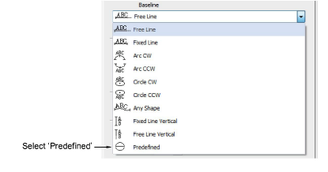
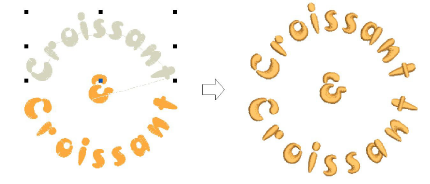

# Use predefined baselines

Use Predefined baselines to quickly create three rows of lettering, or two rows surrounding a design object. This technique is typically used for creating logos.

## To use a predefined baseline...

1With no objects selected, right-click the Lettering icon to access object properties.

2Enter two or three lines of text in the text entry panel. To start a new line of lettering, press Enter.

Tip: If you want to insert a logo or design between the top and bottom lines, leave the middle line of text blank.

3Select the font and adjust other settings you require.

4Select Predefined from the baseline list and click OK.

5Click where you want to place the lettering and drag the cursor downward.

Tip: Hold down the Ctrl key to constrain the line to 15° increments.

6Click to enter a point on the circumference of the circle.

7Mark another point if you want to create an oval, or press Enter for a circular baseline. The lines of text are generated and dispersed around the baseline you have defined. Each line of text becomes a separate lettering object.

## Related topics...

- [Select embroidery fonts](Select_embroidery_fonts)
- [Format lettering](Format_lettering)
