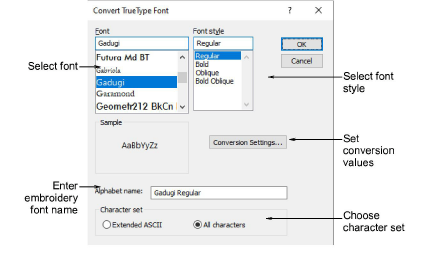
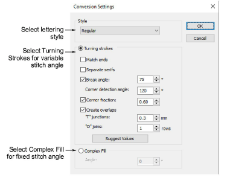

# Convert TrueType fonts

The Convert TrueType Font feature lets you convert any suitable TrueType font installed on your system into an embroidery font. Converted letters can be filled with parallel or turning stitches. Conversion happens fairly quickly, although Asian fonts may take longer.

## To convert a TrueType font...

- Select Setup > Convert TrueType Font. The Convert TrueType Font dialog opens.

- Select the font to be converted and font style. The entire embroidery font will be created in the selected style.
- Enter a Font Name if you want to override the default.
- Choose whether to convert All Characters or Extended ASCII character sets. The standard character set contains alphanumeric characters only. It excludes punctuation marks and other special characters.
- Optionally, click Conversion Settings to adjust conversion settings.

- Specify whether to convert as Turning Strokes or Complex Fill.

This will depend in part on font type – whether serif or non-serif, whether script or block. If you want stitching to follow letter contours, select Turning Strokes. The Complex Fill option provides a single fixed [stitch angle](../../glossary/glossary#stitch-angle).

- With the Turning Strokes option, there are many more settings. Presets are automatically adjusted according to selected font characteristics – e.g. whether serif or sans serif, whether block or script. Try the defaults to start with.
- Click OK.
- To check, right-click the Lettering icon to open the Object Properties > Special > Lettering docker. The newly converted font will be selected by default and available for use.

::: info Note
Custom fonts are saved in ESA format to the ‘Fonts’ folder within the Windows ‘ProgramData’ folder. They can be copied and distributed for use by others. If you want to adjust converted characters or add special characters to a custom font, you can do so via the Create Letter function.
:::

## Related topics...

- [Converting & editing TrueType fonts](../../Management/custom_fonts/Converting_editing_TrueType_fonts)
- [Refine turning stroke options](../../Management/custom_fonts/Refine_turning_stroke_options)
- [Edit & repackage generated letters](../../Management/custom_fonts/Edit_repackage_generated_letters)
- [Custom asset locations](../../Management/manage%5Fassets/Custom%5Fasset%5Flocations#XREF%5F78115%5FCustom%5Fasset)
