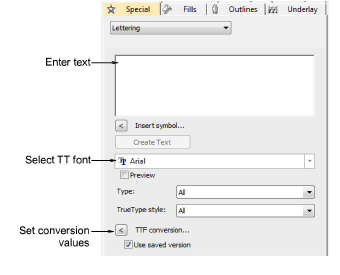
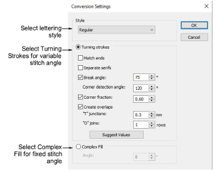

# Convert letters on-the-fly

|  | Use Toolbox > Lettering to add TrueType lettering directly on-screen. Right-click to set the formatting values for new or selected lettering objects. |
| -------------------------------------- | ----------------------------------------------------------------------------------------------------------------------------------------------------- |

You can convert individual TrueType letters ‘on-the-fly’ and add them directly to a design through the Object Properties docker.

Tip: If your product level allows it, you can add and format TrueType lettering in CorelDRAW Graphics. This can then be converted to either embroidery lettering or embroidery objects.

## To convert TrueType letters on-the-fly...

1. Right-click the Lettering icon to access object properties.

2. Select a TrueType font from the droplist.

3. Enter the text you want to embroider.

4. Optionally, click TTF Conversion to adjust conversion settings. Whenever you choose a TrueType font in the Object Properties docker, calculated settings are used by default. As always, conversion settings can be further refined by the user.

5. Click OK to return to the Object Properties > Special > Lettering docker.

6. Select a baseline, adjust letter height and spacings, and click Create Text.

7. Click an insertion point to create text on-screen.

## Related topics...

- [Converting & editing TrueType fonts](../../Management/custom_fonts/Converting_editing_TrueType_fonts)
- [Experiment with conversion settings](../../Management/custom_fonts/Experiment_with_conversion_settings)
- [Refine turning stroke options](../../Management/custom_fonts/Refine_turning_stroke_options)
- [Creating lettering with CorelDRAW Graphics](../lettering_create/Creating_lettering_with_CorelDRAW_Graphics)
