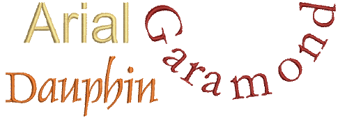

# Converting TrueType fonts to embroidery

The Convert TrueType Font feature lets you convert any TrueType font installed on your system to an embroidery font. You can do this ‘on-the-fly’ or convert entire fonts for later use. This is an important feature for Asian fonts which may contain several thousands of characters.

The process is fully automatic. Lettering shapes are ‘cut’ into [Column A](../../glossary/glossary) or [Column B](../../glossary/glossary) embroidery objects. Overlaps and stroke order are detected and [stitch angles](../../glossary/glossary) defined. The result is similar to manually digitized fonts although the quality may not be quite as good. The quality greatly depends on the original shapes, narrower serif type fonts producing better results than blocked fonts.

::: tip
The simplest option for creating custom embroidery fonts is to use the built-in Convert TrueType Font feature. This lets you convert any TrueType font installed on your system to an embroidery font. [See Custom Fonts for details.](../../Management/custom_fonts/Custom_Fonts)
:::

## Related topics...

- [Convert letters on-the-fly](Convert_letters_on-the-fly)
- [Convert TrueType fonts](Convert_TrueType_fonts)
