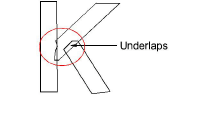
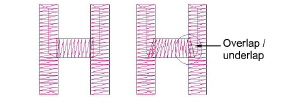
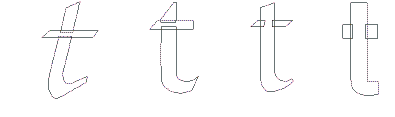
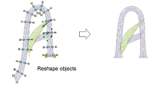

# Create custom letters

|                  | Use Edit > Break Apart to split composite objects – monograms, appliqués, lettering, etc – into component objects. |
| -------------------------------------------------------- | ------------------------------------------------------------------------------------------------------------------ |
|  | Use Reshape > Reshape Object to reshape custom letters.                                                            |

You create or modify letters for a custom font just like other embroidery objects. Custom letters can be made up of multiple objects, and may be letters, numbers, symbols or even pictures. To change the shape of an existing letter, you must first break it apart. The letter reverts to embroidery objects, and letter properties such as font type and baseline are lost. When you have finished modifying, you have to enter these details again.

## To create a custom letter...

1. Import the starting point for your custom letter. You can use various methods:

- Import and size suitable artwork. Letters are generally 20 to 40 mm in height.
- Select a TrueType font in CorelDRAW Graphics, key in the letter or letters you want to use, and switch back to Wilcom Workspace.
- Pre-convert an entire TrueType font using the Convert TrueType Font feature.
- Select an existing embroidery font and key in the letter or letters you want to use.

2. If you use an existing embroidery font as a starting point, you must first Break Apart to revert the letter to normal embroidery objects. Letter properties such as font type and baseline are lost.

3. Select an input method.

- If you are digitizing the sequence and connectors manually, use any input method.
- If you want the letter to be automatically resequenced with Closest Join or Bottom Join, use [Column A](../../glossary/glossary), [Column B](../../glossary/glossary), [Column C](../../glossary/glossary) and Complex Fill objects.

4. Select a stitch type. Most letters use satin or tatami.

5. Digitize each section of the letter.

- Create an ‘underlap’ to bind two strokes together. Underlaps should be about a third of the stroke width or less, but may be half for thin strokes.

- Try to avoid having more than two strokes on top of each other as this causes thread buildup and can lead to thread breaks. Sometimes modifying the shape can improve it.
- Sometimes it is helpful to angle the ends of underlaps so that a few stitches are ‘caught’ by the overlapping stroke.

- Where a stroke crosses another stroke, such as in the letter t, one stroke is commonly broken into two parts. For thin objects, you may digitize the above stroke in one piece, crossing over or under the other.

6. Adjust existing outlines using the Reshape Object tool if necessary.

7. When the letter is the correct shape, you can now save it as a custom letter.

## Related topics...

- [Insert bitmap images](../../Automatic/bitmaps/Insert_bitmap_images)
- [Convert TrueType fonts](Convert_TrueType_fonts)
- [Reshape letters](../lettering_edit/Reshape_letters)
- [Break apart composite objects](../../Modifying/reshape/Break_apart_composite_objects)
- [Save custom letters](Save_custom_letters)
