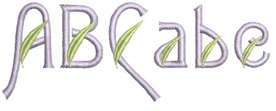

# Custom Lettering

Turn any TrueType font installed on your system into an embroidery font. Sometimes you find that you want to reshape a letter to improve its appearance, perhaps to suit a particular lettering height. EmbroideryStudio lets you save the letter as an alternative version. You can even create custom fonts or modify an existing font for special applications. Even merge letters from two or more fonts.

This section describes how to create new embroidery fonts from TrueType fonts. Automatic letter kerning and user-refined fonts are explained. It also describes how to create, modify, and merge your custom fonts and letters.

## Related topics...

- [Converting TrueType fonts to embroidery](Converting_TrueType_fonts_to_embroidery)
- [Creating user-refined letters](Creating_user-refined_letters)
- [Creating custom fonts](Creating_custom_fonts)
- [Merging fonts](Merging_fonts)
