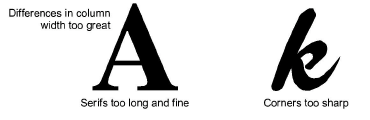

# Custom font considerations

You can use [artwork](../../glossary/glossary#artwork) to create letters in the same way you do other objects. Before digitizing, however, establish whether the letter shapes are suitable for embroidery, and determine reference height and baseline for the font. Letters are generally 20 to 40 mm in height.

::: warning Caution
Because of copyright laws, you cannot simply select letters from an existing embroidery font and save them to another font.
:::

## Letter shapes

For best results, letter columns should be of similar width, without tight curves or sharp corners, or very fine, very wide, or curved serifs.

## Reference height and baseline

Reference height is the maximum height of capital letters. Although there may be subtle differences between upper and lower case letters, it is a useful guide for digitizing. Place letters along a standard baseline to help digitize at a standard height. Draw in the baseline if you are digitizing from [artwork](../../glossary/glossary#artwork), or use a grid line as your guide. Descenders in letters such as y or g generally fall below the baseline.

::: tip
Use E or H as reference letters to determine the height and baseline for the font. These letters work well because they sit on the baseline and do not extend above the standard cap-height.
:::

## Letter spacing and width

Letter width varies with letter shape and spacing. When you digitize letters, you enter two reference points to mark the width, and a third to mark height.

Default spacing affects ‘kerning’ or spacing across all letters. Additional width can be added as spacing around individual letters.

::: tip
For italic styles, you may need some overlap between letter extents.
:::

## Letter sequencing

Letter stitching sequence is based on the join type you select when saving the font. If you use the Closest Join or Bottom Join methods, EmbroideryStudio applies automatic [branching](../../glossary/glossary#branching) to letters. In this case, you don’t need to worry about the direction individual letter strokes will stitch in. When branching is applied, EmbroideryStudio determines where each stroke starts and ends, adding travel runs as necessary.

However, it is good practice to digitize strokes in the direction they are most likely to be stitched in. It is also important to specify the stroke order as this is maintained when sequencing is calculated.

If you want to specify the stitching sequence and [connectors](../../glossary/glossary#connectors) yourself, digitize the letter exactly as you want it stitched. You then need to select As Digitized as the join method.

The lettering stitch method should be preset to give the best results for each font. In most cases, Closest Join is recommended in order to minimize trims. Bear in mind though that the join method can be changed by the end user.

## Related topics...

- [Change lettering join method](../lettering_advanced/Change_lettering_join_method)
