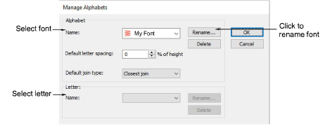
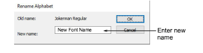
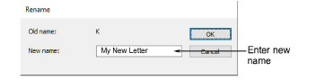

# Manage fonts

Modify custom fonts by changing names, default letter spacings and join types. If a font is no longer required, delete it. To modify fonts, select Setup > Manage Alphabets.

Use this dialog to:

- Rename a custom font.

- Delete a font.
- Change default letter spacing.
- Change the default join type.
- Delete or rename selected letters. You can use names with more than one character.

## Related topics...

- [Adjust spacing settings](../lettering_create/Adjust_spacing_settings)
- [Setting stitching sequence & join method](../lettering_advanced/Setting_stitching_sequence_join_method)
