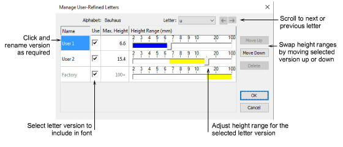

# Manage user-refined letters

User-refined letters are managed via the Manage User-Refined Letters option. This menu item is only enabled when a lettering object with a font containing user-refined letters is currently selected.

## To manage user-refined letters...

- While the letter is selected, select Setup > Manage User-Refined Letters.

The original factory default letter is identified by the name ‘Factory’. For converted TrueType font letters, the word ‘Convert’ appears instead of ‘Factory’.

- Use left/right arrow buttons or droplist to select a user-refined letter.
- Click and rename any version except ‘Factory’ or ‘Convert’.
- Delete any selected version name except ‘Factory’.
- Untick the Use checkbox if you want to temporarily exclude a letter.
- Swap height ranges with the Move Up/Down buttons and adjust them by means of slider bars.
