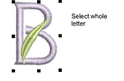
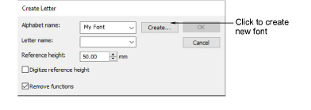
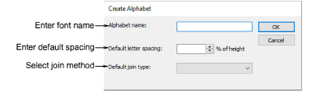

# Save custom fonts

Use custom fonts to store any letters you create. To make a new font, you name it and set the [default](../../glossary/glossary) spacing and join type for adjacent letters. You also specify the file type.

## To save custom fonts...

1. Digitize the objects that make up the new letter, and select them.

2. Select Object > Create Letter.

3. Click Create. The Create Alphabet dialog opens.

4. Enter a name for your new font.

5. Enter spacing in the Default Letter Spacing field. As a rule of thumb:

- Use 8-10% for standard fonts such as block and serif styles.
- Use 0% for script-style fonts.

6. Select a method of joining adjacent letters in the Default Join Type list.

| Option       | Function                                                                                                                                              |
| ------------ | ----------------------------------------------------------------------------------------------------------------------------------------------------- |
| As digitized | Preserves the original stitching sequence of each letter as it was digitized, as well as any stitch types and machine functions used in its creation. |
| Closest join | Resequences entry and [exit points](../../glossary/glossary) in adjacent letters to join them at the closest point.                                   |
| Bottom join  | Resequences entry and exit points in adjacent letters to create a connector along the lettering baseline.                                             |

::: info Note
The lettering stitch method should be preset to give the best results. In most cases, Closest Join is recommended in order to minimize trims. Bear in mind though that the join method can be changed by the end user.
:::

7. Click OK.

8. Enter additional values for the selected letter in the Create Letter dialog.

## Related topics...

- [Create custom letters](Create_custom_letters)
- [Change lettering join method](../lettering_advanced/Change_lettering_join_method)
- [Save custom letters](Save_custom_letters)
