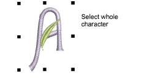
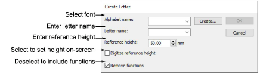
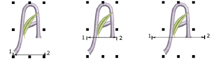

# Save custom letters

When you create a new letter, you need to select a font for it, give it a name, specify its height, and indicate whether to preserve any [machine functions](../../glossary/glossary). You also need to indicate its spacing settings by digitizing reference points on-screen.

Caution: Do not use the tilde (\~) symbol when naming letters. This is a special character for entering letters with multiple-character names.

## To save custom letters...

1. Select the objects that make up your newly digitized or modified letter.

2. Select Object > Create Letter.

3. Select a font from the droplist.

4. Enter a name for the letter in the Letter field.

For example, if you digitized the letter H, enter ‘H’ in the Letter field.

Tip: You can create names with multiple characters to identify special letters – e.g. ‘Star’ for a star symbol, or ‘e-acute’ for é.

5. In the Reference Height field, enter a height for the letter.

The letter is recorded at this height regardless of its original size. You can also set height on-screen by selecting the Digitize Reference Height checkbox. When you return to the design window, you are prompted to digitize the height. If you select Digitize Reference Height, the value in the Reference Height field is ignored. Letters are generally 20 to 40 mm in height.

6. Deselect Remove Functions only if you want to keep any [machine functions](../../glossary/glossary) in the object.

The letter may, for example, include deliberate color changes or other machine functions. Such letters require the As Digitized join type.

7. Click OK.

8. Click to mark two reference points for letter width and baseline.

The distance between reference points determines the letter width, including any spacing either side of the letter. This then determines ‘standard spacing’ between letters.

Note: The reference points you digitize also determine where the letter sits on the baseline.

9. If you selected Digitize Reference Height in the Create Letter dialog, you are prompted to digitize a third reference point to mark letter height.

A message confirms that the letter has been saved to current font.

## Related topics...

- [Select custom fonts](Select_custom_fonts)
- [Create custom letters](Create_custom_letters)
- [Save custom fonts](Save_custom_fonts)
- [Select custom fonts](Select_custom_fonts)
- [Change lettering join method](../lettering_advanced/Change_lettering_join_method)
- [Letter spacing and width](Custom_font_considerations)
- [Reference height and baseline](Custom_font_considerations)
