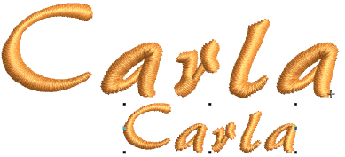
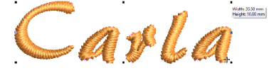
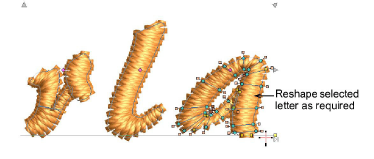
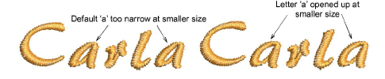
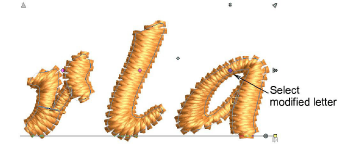
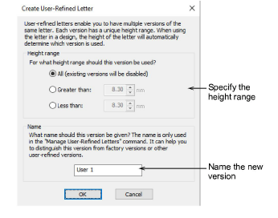
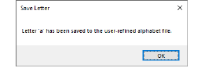
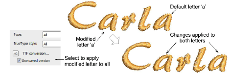

# Save user-refined letters

|  | Use Reshape > Reshape Object to reshape selected objects, edit stitch angles, and adjust start/end points. |
| ---------------------------------------------- | ---------------------------------------------------------------------------------------------------------- |

User-refined letters are saved via the Create User-Refined Letter option. This is enabled only if a native letter or converted TrueType font letter is currently highlighted in the design window or selected in Reshape mode. One and only one letter may be saved at a time.

## To save a user-refined letter...

1Create a lettering object with an embroidery font and size it to the required dimensions.

2Use the Reshape tool to reshape selected letters as necessary. The Stitch Angle and Reshape Object tools let you add, delete, or adjust stitch angles.

In the example, the letter ‘a’ tends to close over at reduced sizes. You may want to open it up. By saving it as a user-refined letter, any changes made will be automatically applied to new lettering objects using the font in the specified size range.

3Still in Reshape mode, select the modified letter by clicking the diamond control point.

4Select Object > Create User-Refined Letter.

5Set a height range for the letter:

| Option       | Function                                                                                   |
| ------------ | ------------------------------------------------------------------------------------------ |
| All          | The letter will be used at all letter heights (effectively replacing the factory default). |
| Greater than | The letter will only be at heights greater than that specified.                            |
| Less than    | The letter will only be at heights less than that specified.                               |

6Give the new letter a unique name that you can easily identify. By default, the new version is given the name ‘User 1’.

7Click OK. A confirmation message appears. The letter is now available for use in all new lettering created with this font.

Tip: To apply changes to all the same letters in the selected object, select the Use saved version checkbox in the Object Properties > Special > Lettering docker.

## Related topics...

- [Creating Embroidery Lettering](../lettering_create/Creating_Embroidery_Lettering)
- [Reshape letters](../lettering_edit/Reshape_letters)
- [Adjusting stitch angles](../../Quality/quality/Adjusting_stitch_angles)
- [Select embroidery fonts](../lettering_create/Select_embroidery_fonts)
